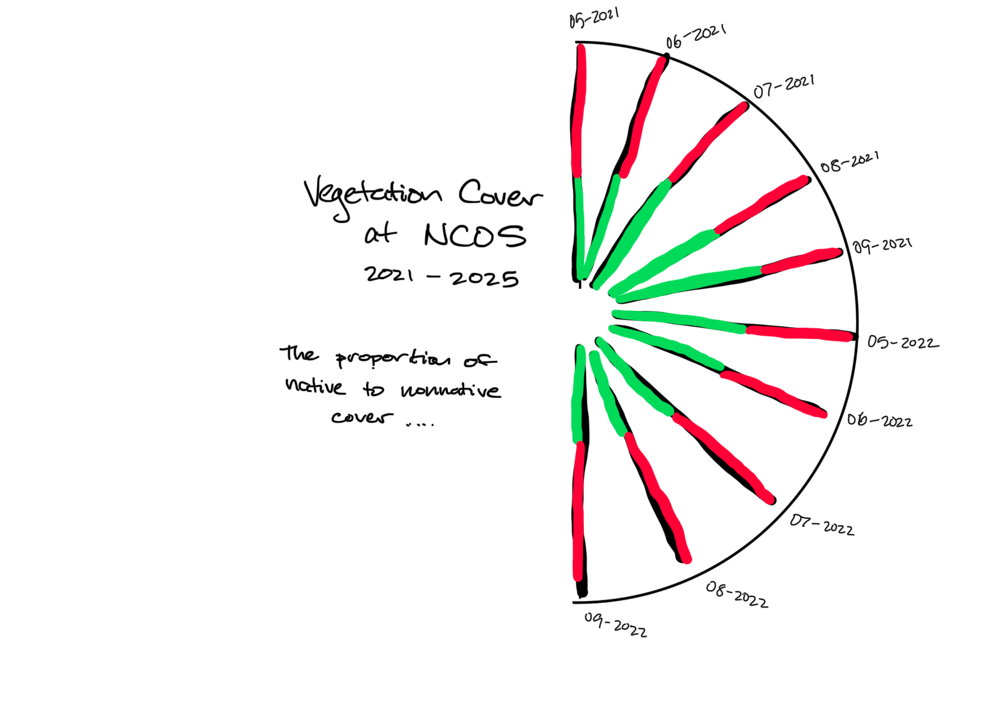

# Set up

## Packages
```{r}
#| label: packages
# general use
library(tidyverse)
library(ggtext)

# file organization
library(here)

# fonts
library(showtext)
```

## Fonts

```{r}
#| label: adding-font
# add Literata font
font_add_google("Literata", "Literata")
# automatically use in figures
showtext_auto()
```

## Data
```{r}
#| label: data
# vegetation data
veg <- read_csv(here("data", "veg.csv"))
# vegetation metadata
metadata <- read_csv(here("data", "vp_veg_metadata.csv"))
```

### Data cleaning and wrangling

```{r}
#| label: native-vector

# creating new vector from veg
native_spp <- veg |> 
  # filter all occurrences where cover catecory is native
  filter(site == "ncos" &
           cover_category == "NATIVE COVER") |> 
# pull to extract data frame column as a vector
  pull(psoc)
```

```{r}
#| label: nonnative-vector

# creating new vector from veg
nonnative_spp <- veg |> 
  # filter all occurrences where cover category is non-native
  filter(site == "ncos" &
           cover_category == "NON-NATIVE COVER") |> 
# pull to extract data frame column as a vector
  pull(psoc)
```

```{r}
#| label: cleaning-veg
# creating new object from veg
veg_explicit0 <- veg |> 
  # filter all occurrences where site is ncos
  filter(site == "ncos") |> 
  # create a column for month
  mutate(month = month(date)) |>
  # create a year_month combined columns
  unite("year_month", year, month, sep = "-", remove = FALSE) |> 
  # create a column for native status
  mutate(native = case_when(
    psoc %in% native_spp ~ "native",
    psoc %in% nonnative_spp ~ "non_native",
    .default = "other"
  )) |> 
  # complete all possible combinations of year, pool, psoc and distance
  complete(year_month, transect_name, psoc, transect_distance,
           # fill values of percent cover with 0
           fill = list(percent_cover = 0)
           ) |>
  # group by year, pool, and native
  group_by(year_month, year, transect_name, native) |>
  # calculate total percent cover across all quads
  summarize(sum_pc = sum(percent_cover, na.rm = TRUE)) |>
  # ungroup the data frame
  ungroup() |>
  # create a new column called year_pool from year and transect name
  unite("year_pool", year, transect_name, remove = TRUE) |> 
  # join with metadata data frame
  left_join(metadata, by = "year_pool") |> 
  # calculate mean percent cover from total percent cover/number of quadrats
  mutate(mean_pc = sum_pc/num_quad) |> 
  # remove null rows and "other" native status
  filter(!str_detect(year_pool, "NA"),
         native != "other") |> 
  # group by year_month and native status
  group_by(year_month, native) |> 
  # sum the mean percent cover
  summarize(mean_pc_sum = sum(mean_pc)) |> 
  # ungroup
  ungroup()
```

```{r}
#| label: veg-wider
# create a new object from veg_explicit0
veg_wider <- veg_explicit0 |> 
  # pivot to a wider data frame
  pivot_wider(
    # native status as columns
    names_from = native,
    # sum of mean_pc as values
    values_from = mean_pc_sum
  ) |> 
  # calculate relative percent coverage of native and nonnative
  mutate(perc_native = native / (native + non_native) * 10,
         perc_nonnative = non_native / (native + non_native) * 10)
```

```{r}
#| label: veg-wider-modify
# modify veg_wider further
veg_wider <- veg_wider |> 
  # create new columns for visualization parameters
  mutate(len = seq(0, pi, length.out = 19),
         x = sin(len),
         y = cos(len),
         xend = sin(len) * 10,
         yend = cos(len) * 10,
         y_range = yend - y,
         x_range = xend - x) 
```

```{r}
#| label: final-veg
# create a new object from veg_wider
final_veg = veg_wider |> 
  # set new values using values from veg_wider for later geom_segment
  transmute(year_month = year_month,
           # set starting x coord for native
           x_native = x,
           # set ending x coord for native
           x_native_end = x + ((perc_native * x_range) / 10),
           # set starting y coord for native
           y_native = y,
           # set ending y coord for native
           y_native_end = y + ((perc_native * y_range) / 10),
           # set starting x coord for nonnative
           x_nonnative = x_native_end,
           # set ending x coord for nonnative
           x_nonnative_end = xend,
           # set starting y coord for nonnative
           y_nonnative = y_native_end,
           # set ending y coord for nonnative
           y_nonnative_end = yend)
```

# Problems

## 1. Explain your inspiration

In 1-2 sentences each, describe:

- which visualization you chose for your inspiration
  - For my inspiration piece, I selected Ijeamaka Anyene’s “Historically Black Colleges and Universities”.
- why it makes sense for your dataset of choice
  - This visualization makes sense for the vegetation dataset since we can also create a binary variable, "native/nonnative" instead of Ayene's "female/male". It also makes sense to see how the proportion of native to nonnative vegetation cover changes over time to reflect the outcomes of restoration efforts over time. 
- which variables from your dataset will be shown in your visualization, and what visual components they map onto (axes, shapes, colors, etc.)
  - The variables that will be shown in my visualization are: native/nonnative cover and month-year. The native/nonnative cover will map onto the bars, and each bar will represent one month-year.

## 2. Plan your figure
Sketch what your figure would look like following your inspiration.




## 3. Code your figure

Clean/wrangle your data as needed.

Then, code the figure you decided to create.

Make sure all your code is annotated, and that the output is showing.

At the end of this section, include code to save your final figure as a .jpg or .png file.

```{r}
#| label: year-labels
# create a new object from veg_wider
year_labels <- veg_wider |> 
  # create new columns for year_month text positioning, set x coord
  mutate(x = sin(len) * 11,
         # set y coord
         y = cos(len) * 11,
         # set text angle
         angle = c(seq(90, 0, length.out = 10),
                   seq(360, 270, length.out = 9))) |>
  # select columns of interest
  select(year_month, x, y, angle)

```

```{r}
#| label: titles
# create a new object for titles
titles <- tibble(
  x = -1,
  y = 0, 
  # text to be shown
  label = "<span style='color:white;font-size:30pt'>**Vegetation Cover<br>
  across NCOS**</span><br>
<span style='color:white;font-size:18pt'>*2021 - 2025*</span><br><br>
<span style='color:white;font-size:12pt'>The proportion of <span style='color:#4CAF50'>native</span> vegetation cover<br>has fluctuated over time, being lower on<br>average during early summer months.</span>."
)

```

```{r fig.width=8, fig.height=9}
#| label: veg-plot
# base layer: ggplot
ggplot(data = final_veg) + 
  # native lines 
  geom_segment(aes(x = x_native, y = y_native,
                 xend = x_native_end, yend = y_native_end),
               size = 2,
               color = "#13986f") + 
  # nonnative lines
  geom_segment(aes(x = x_nonnative, y = y_nonnative,
                 xend = x_nonnative_end, yend = y_nonnative_end),
               size = 2,
               color = "#e5e3dc") + 
  # title
  geom_richtext(data = titles,
                aes(x = x, y = y, label = label),
                family = "Literata",
                hjust = 1,
                fill = NA,
                color = NA) +
  # Year-month Label
  geom_text(data = year_labels,
            aes(x = x, y = y, label = year_month,
                angle = angle),
            family = "Literata",
            color = "white") +
  # set x scale limit
  xlim(-15, 11) +
  # add caption
  labs(caption = "Source: Cheadle Center for Biodiversity and Ecological Restoration | Viz: Henderson Vo | Template: Ijeamaka Anyene - @ijeamaka_a") +
  coord_fixed() +
  # change theme
  theme_void() +
  # customize theme, set margin color
  theme(plot.background = element_rect(fill = "#33494f"),
        # set margin dimensions
        plot.margin = margin(4, 4, 4, 4, unit = "pt"),
        # set background color
        panel.background = element_rect(fill = "#33494f"),
        # settings for caption
        plot.caption = element_text(color = "white",
                                    family = "Literata",
                                    size = 7)
        )

```

```{r}
#| label: saving-image
# save plot as image
ggsave("2026_05_ncos.png", 
       # save last plot
       plot = last_plot(), 
       # as .png
       device = "png",
       # in outputs folder
       path = here("outputs"),
       # dimensions
       width = 8, 
       height = 6)

```

## 4. Describe your process

In 1-3 sentences each, describe:

- your process of using someone else’s code to create a visualization
  - I first looked at Ijeamaka Anyene's code to see how she structured her dataset, so that I could also structure my data the same way. I then went through different wrangling steps to match the structure of the hbcu data so that I would be able to reuse the rest of the code. From there, it was a matter to changing labels to describe the vegetation dataset and the trends from it.  
- challenges you encountered as you made your visualization
  - Wrangling the vegetation dataset was definitely the most difficult part because I had to mentally work backwards from the variables I knew I needed at the end. The caption was also difficult to format since I am not familiar with html scripting or the richtext geometry. 
- how your visualization differs from visualizations you made in class, for assignments, or for a previous elective
  - One major way that this visualization differs from class visualizations is that this one doesn't use obvious axes; it's like a column plot but it's curved around a central point. There is also much more flexibility with titling and captioning using the richtext geometry than the traditional `labs()`. 


